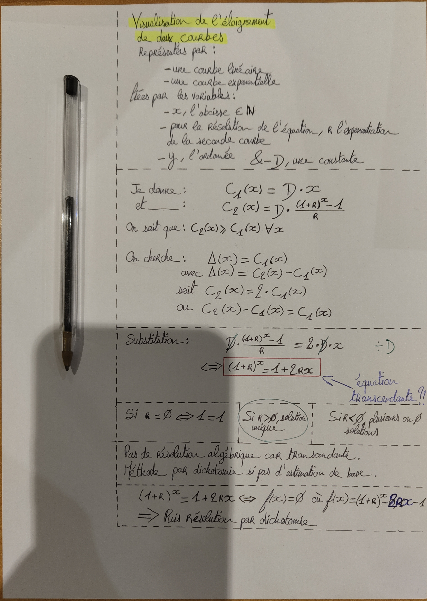
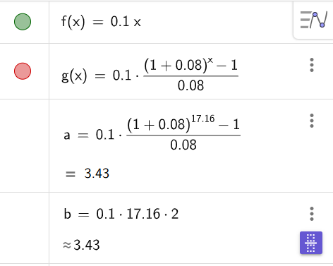

# maths-bizarres
Je sais même pas comment décrire ça  

En gros j'avais deux courbes, l'une linéaire et l'autre exponentielle pour qui C1(0) = C2(0) = 0. 
Voilà mon brouillon c'est plus simple. 

Exemple sur Geogebra 

Sur la feuille j'utilise 2 comme valeur de delta.
